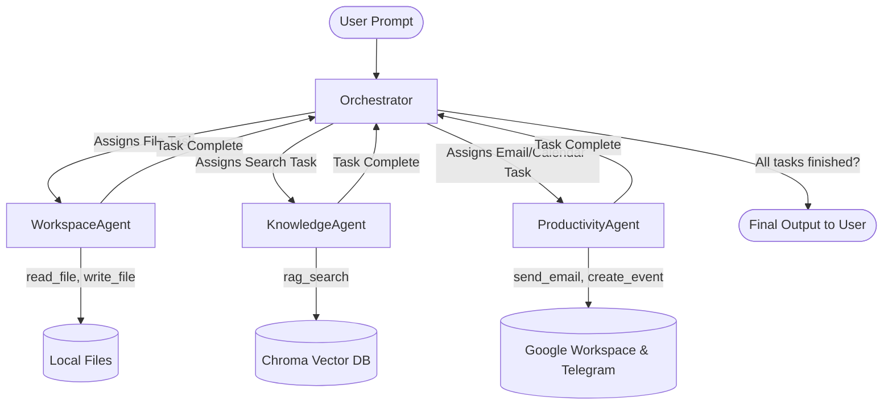

# SmartDesk: Multi-Agent AI Assistant 🤖

**SmartDesk** is an advanced, hierarchical multi-agent AI assistant designed to automate your workspace, manage your productivity, and query your knowledge base. It is powered by the blazing-fast Groq API, specifically utilizing the highly capable **GPT-OSS-120B** open-weights model, and orchestrated via **LangGraph**.

## 🌟 Key Features

- **Multi-Agent Orchestration**: A central LLM orchestrator breaks down complex user prompts and autonomously delegates tasks to specialized sub-agents.
- **Workspace Agent**: Manages your local file system. Can create folders, read files, search the directory, and draft new documents locally.
- **Knowledge Agent (RAG)**: Indexes your `KnowledgeBase` folder (PDFs, Markdown, Docs) into a local ChromaDB vector store. Uses an efficient metadata system to only re-index new or modified files.
- **Productivity Agent**: Seamlessly integrates with Google Workspace (Calendar, Tasks, Docs, Drive) and acts as a 1-way notification system via **Telegram**.
- **Resilient Fallbacks**: If Google API credentials are not provided or if scopes mismatch, all connectors gracefully fall back to local JSON mocks (`calendar.json`, `tasks.json`, etc.) without crashing!
- **Interactive UI**: Includes a fully functional Chat UI built with **Streamlit** for a seamless, interactive user experience.

---

## 🏗️ Architecture (LangGraph)



---

## 🚀 Getting Started

### 1. Prerequisites
- **Python 3.10+**
- **Groq API Key**: You need a free Groq API key for the LLM inference.
- *(Optional)* **Google Cloud Credentials**: `credentials.json` if you want to use the live Gmail/Calendar/Docs/Drive integrations.

### 2. Installation
Clone the repository and install the dependencies in a virtual environment:

```bash
python -m venv .venv
source .venv/bin/activate  # On Windows: .venv\Scripts\activate
pip install -r requirements.txt
```

### 3. Environment Variables
Create a `.env` file in the root directory:
```env
GROQ_API_KEY=your_groq_api_key
GMAIL_ADDRESS=your_email@gmail.com
GMAIL_APP_PASSWORD=your_app_password
TELEGRAM_BOT_TOKEN=your_telegram_bot_token
TELEGRAM_CHAT_ID=your_chat_id
```

### 4. Running the UI
We provide a beautiful web interface powered by Streamlit:

```bash
streamlit run app.py
```

### 5. Running the CLI
If you prefer the terminal, you can interact directly via the CLI:
```bash
python main.py
```

---

## 📚 Adding to the Knowledge Base (RAG)
Simply drag and drop your PDFs, `.md`, or `.txt` files into the `KnowledgeBase/` folder. 
When the app starts, it will automatically detect the new files and index them into `chroma_db/`. You can ask the assistant about them immediately!

## 🧪 Running Tests
SmartDesk comes with a comprehensive testing suite simulating complex orchestrator routings for both individual agents and mixed end-to-end workflows:
```bash
python test_end_to_end.py
```

## 🔧 Troubleshooting
- **API Fallbacks (Fake Links)**: If your Google credentials (`token.json`) don't match the required `SCOPES` (e.g. if you added Drive/Docs support recently), the agent will safely fall back to "Mock Mode" and might hallucinate fake Google Drive links. **Fix**: Delete `token.json` and restart the app to force a new Google Auth popup.
- **Payload Too Large (413)**: Large local directories (like `.venv` or `__pycache__`) can cause payload limits to be exceeded if the agent tries to search them. We have explicitly patched the `search_file` tool to ignore these massive folders.
- **Telegram Doesn't Reply**: The Telegram integration is currently a 1-way broadcast (Agent -> User). It does not actively listen for your replies. Use the Streamlit UI for sending commands to the Orchestrator.
