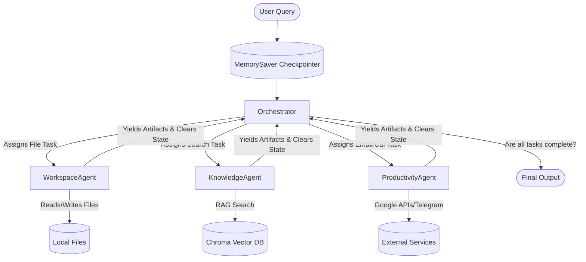

# SmartDesk: Multi-Agent AI Assistant 🤖

Welcome to the **SmartDesk** repository. This isn't just another API wrapper—it's a hierarchical, multi-agent AI assistant orchestrated via **LangGraph**, powered by the blazing-fast **Groq API** (specifically utilizing the open-weights **GPT-OSS-120B** model). 

This README is designed to act as your ultimate blueprint. Whether you are studying the codebase or running it locally, this document breaks down the underlying architecture, state management, memory handling, and the inner workings of our specialized agents.

---

## 🏗️ The Blueprint: System Architecture

SmartDesk operates on a **Supervisor-Worker (Orchestrator-SubAgent)** pattern using **LangGraph**. The entire system acts as a state machine where a central Orchestrator plans tasks, delegates them to specialized workers (agents), and aggregates the results into structured artifacts.



### 1. The Global State (`state.py`)
At the core of the LangGraph implementation is the `GraphState`. Every node in the graph reads from and writes to this state. Key components include:
- `current_task` & `completed_tasks`: The Orchestrator breaks user queries into a queue of `Task` objects.
- `messages`: The overarching conversation history between the User and the Orchestrator.
- `workspace_messages`, `knowledge_messages`, `productivity_messages`: Isolated message histories for each sub-agent.
- `artifacts`: A structured dictionary where agents drop their findings (e.g., file contents, search results) instead of polluting the chat history with massive text dumps.
- `checkpointer`: A `MemorySaver` instance that persists the graph state across turns based on a `thread_id` (e.g., Streamlit `chat_id`).

### 2. The Orchestrator
The Orchestrator is the brain. When a user sends a query:
1. It analyzes the query and the current state.
2. It generates a step-by-step plan, creating `Task` objects.
3. It routes the graph execution to the specific sub-agent required for the current task.
4. Once an agent finishes, the Orchestrator reviews the generated `Artifacts` to determine if the user's query is fully answered or if more tasks are needed.

---

## 🕵️ The Sub-Agents and Their Tools

Each sub-agent is a localized ReAct (Reasoning + Acting) loop with a specific domain of tools.

### 💼 Workspace Agent
Manages local file system operations.
- **Capabilities**: Can list directories, read files, write new documents locally, and search the directory.
- **Architectural Quirks solved**: 
  - *Token Limits*: Explicitly patched to ignore massive local directories like `.venv` or `__pycache__` to prevent 413 Payload limits.
  - *Multi-File Context*: When reading multiple files in a single task, it generates distinct `RAW_CONTEXT` artifacts for each file read, preventing data loss.

### 🧠 Knowledge Agent (RAG)
Handles indexing and retrieval of local knowledge.
- **Capabilities**: Ingests PDFs, Markdown, and TXT files dropped into the `KnowledgeBase/` folder.
- **Architecture**: Uses a local **ChromaDB** vector store. It features an efficient metadata-diffing system to only re-index files that are new or have been modified since the last run.

### 📅 Productivity Agent
Integrates with external services (Google Workspace & Telegram).
- **Capabilities**: Gmail (read/send), Google Calendar (create/check events), Google Docs/Sheets, and 1-way Telegram notifications.
- **Architecture & Fallbacks**: Features a highly resilient fallback mechanism. If Google API credentials (`token.json`) are missing, invalid, or have mismatched scopes, the agent gracefully falls back to "Mock Mode" using local JSON files (e.g., `calendar.json`, `tasks.json`) without crashing the application.
- **Safeguards**: Email fetching is hard-capped (max 10 emails) to prevent massive payloads from crashing the Groq LLM context window.

---

## 🛠️ Advanced Engineering: Memory & Artifacts

Building a multi-agent system often leads to context contamination (agents getting confused by old messages). SmartDesk solves this with two advanced paradigms:

1. **The "Clean Slate" Finalizers (Cross-Task Contamination Fix)**
   - **The Problem**: An agent's message list would grow infinitely with every task, confusing it about what it was currently supposed to do.
   - **The Solution**: At the end of every agent's task, a "finalizer" node runs. It uses LangChain's `RemoveMessage` to delete all intermediate scratchpad thoughts and tool calls from that specific task run. When the agent is called again for a *new* task, it starts with a completely clean slate, armed only with the new instructions.

2. **The Artifact System (Instead of Raw Text)**
   - **The Problem**: If an agent reads a 500-line file, dumping that into the chat history destroys the context window.
   - **The Solution**: Agents yield `Artifacts` (e.g., `RAW_CONTEXT`, `STATUS`, `SEARCH_RESULTS`). These are structured objects stored in the `GraphState`. The Orchestrator can reference these artifacts by their ID rather than reading the entire raw text, keeping the context window pristine.

---

## 🚀 Getting Started

### 1. Prerequisites
- **Python 3.10+**
- **Groq API Key**: You need a free Groq API key for the LLM inference.
- *(Optional)* **Google Cloud Credentials**: `credentials.json` if you want to use the live Gmail/Calendar/Docs/Drive integrations.

### 2. Installation
Clone the repository and install the dependencies in a virtual environment:

```bash
python -m venv .venv
source .venv/bin/activate  # On Windows: .venv\Scripts\activate
pip install -r requirements.txt
```

### 3. Environment Variables
Create a `.env` file in the root directory:
```env
GROQ_API_KEY=your_groq_api_key
GMAIL_ADDRESS=your_email@gmail.com
GMAIL_APP_PASSWORD=your_app_password
TELEGRAM_BOT_TOKEN=your_telegram_bot_token
TELEGRAM_CHAT_ID=your_chat_id
```

### 4. Running the Application
**Interactive UI (Streamlit):**
Provides a beautiful web interface for chatting and viewing artifacts.
```bash
streamlit run app.py
```

**CLI Mode:**
For terminal lovers and rapid testing.
```bash
python main.py
```

---

## 🧪 Testing Suite
SmartDesk comes with a comprehensive testing suite simulating complex orchestrator routings for both individual agents and mixed end-to-end workflows:
```bash
python test_end_to_end.py
```

## 🔧 Common Troubleshooting
- **API Fallbacks (Fake Links)**: If your Google credentials don't match the required `SCOPES` (e.g., added Drive support recently), the agent will safely fall back to "Mock Mode" and might hallucinate fake Google Drive links. **Fix**: Delete `token.json` and restart the app to force a new Google Auth popup.
- **Payload Too Large (413)**: The Groq API has strict TPM (Tokens Per Minute) limits. The codebase uses safeguards (like capping `fetch_emails` to 10 max) to prevent this, but extremely large text files might still trigger it.
- **Telegram Doesn't Reply**: The Telegram integration is currently a 1-way broadcast (Agent -> User). It does not actively listen for your replies. Use the Streamlit UI for sending commands to the Orchestrator.
